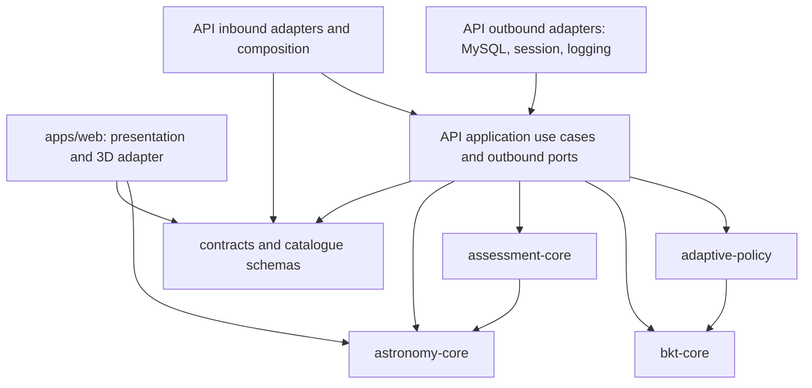
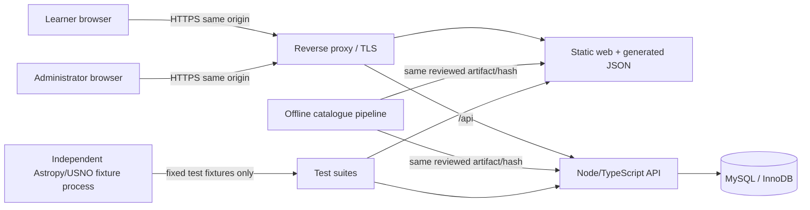
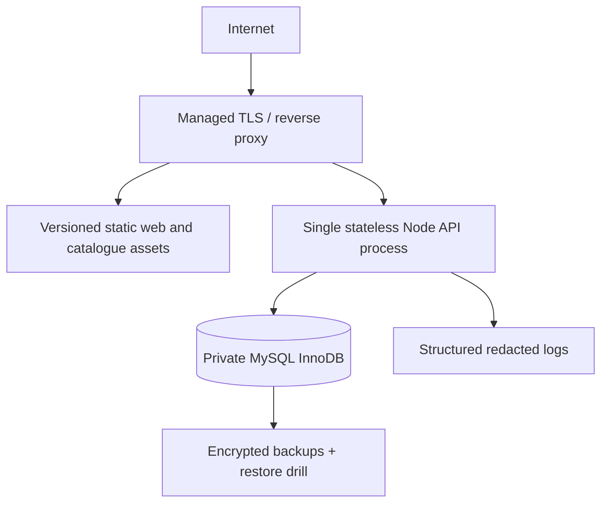

# System architecture

## Decision summary

Use a **TypeScript modular monolith in a monorepo**: one React browser application, one Express-compatible API process, one MySQL/InnoDB database, and framework-free domain packages. This is **CLARIFIED** and fits the report's technology baseline without introducing distributed-system overhead.

React Three Fiber is the proposed React integration layer over Three.js (**CLARIFIED**); direct Three.js APIs remain available for raycasting and performance-sensitive adapters. The application is not replaced by an external planetarium.

Unless a section explicitly says otherwise, implementation-detail conclusions in this document are **CLARIFIED**. Report changes are linked as **PROPOSED DEVIATION**, and values requiring authority are left as **MANUAL DOMAIN DECISION**.

## Architecture style and rationale

- A modular monolith keeps deployment and transactions feasible for a bachelor-level FYP while enforcing boundaries through packages and TypeScript project references.
- Pure deterministic domain packages make astronomy, angular assessment, BKT, and policy behavior independently testable.
- Server authority prevents client manipulation of correctness/mastery and gives retries one transactional truth.
- Versioned generated data separates scientific provenance from runtime efficiency.
- A thin 3D adapter isolates Three.js coordinate and interaction concerns from astronomy conventions.

Microservices, event brokers, and a distributed cache are intentionally absent. Add them only in a future ADR backed by measured need.

## Proposed repository layout

```text
apps/
  web/                    React UI, R3F scene, browser adapters
  api/                    composition root, HTTP/auth adapters, application use cases,
                          outbound ports and MySQL/session adapters
packages/
  astronomy-core/         coordinate/time/Qibla pure functions
  assessment-core/        task answer types and pure scoring
  bkt-core/               pure BKT update and constraints
  adaptive-policy/        pure scaffold state machine
  contracts/              versioned API DTOs and validation schemas
  catalogue-schema/       source/curation/runtime schemas
data/
  sources/                manifests and permitted immutable snapshots
  curation/               reviewed cultural/educational records
  generated/              deterministic deployable JSON, if licence permits
tools/catalogue/           acquisition, transform, verify commands
tests/
  reference/              independent astronomy fixtures/generator metadata
  e2e/                    browser journeys and visual baselines
  performance/            frozen scene and benchmark definitions
docs/                     specifications, decisions, evidence indexes
```

This layout is a plan, not permission to scaffold it before an approved ExecPlan.

## Logical layers and allowed dependencies



Rules:

1. Pure packages may depend only on other explicitly allowed pure packages and standard TypeScript/ECMAScript facilities.
2. No pure package imports React, Three.js, R3F, Express, a SQL client, Node-only I/O, DOM/browser globals, or application code.
3. `assessment-core` may consume astronomy value objects/functions; `adaptive-policy` may consume BKT result types. The reverse directions are forbidden.
4. Applications compose packages through public entry points. Applications do not import each other's internals. API use cases define outbound ports; MySQL, session, logging, and framework adapters implement those ports and depend inward. The composition root is the only place that constructs concrete adapters.
5. Contracts carry units, coordinate frame, time, and version fields explicitly. No unlabelled numeric tuple crosses a boundary.
6. The browser may calculate positions for presentation, but server recalculation is authoritative for scoring.
7. The browser does not import authoritative scorer, target-resolution, or tolerance-resolution entry points from `assessment-core`. Raw answer DTOs live in `contracts`; bundle/import tests enforce this boundary.

## Responsibilities

| Boundary | Owns | Must not own |
|---|---|---|
| Web/UI | Routing, forms, accessible controls, status/error display, own-progress views | Correctness, mastery truth, SQL, secrets |
| 3D scene adapter | Camera, star meshes/buffers, labels/segments, raycaster, resize, conversion from domain vector to Three vector | Sidereal/Qibla formulae, BKT, persistence |
| API inbound/composition | HTTP/session adaptation, schema validation, composition, response shaping | Domain decisions or SQL embedded in controllers |
| API use cases/ports | Authz, scenario issuance, submission orchestration, server scoring, transaction and session ports | UI, rendering, or concrete database/framework code |
| Astronomy core | Explicit time/frame transformations, horizontal/vector conversion, Qibla/angle functions | Catalogue I/O, Three objects, API/database |
| Assessment core | Typed answer validation and scoring against versioned target/tolerance | UI effects, SQL, BKT persistence |
| BKT core | Observation posterior, learning transition, parameter constraints | Hint UI, database, educational claims |
| Adaptive policy | Scaffold transition from approved evidence and policy version | Rendering implementation or mutable state |
| Persistence adapter | Transactions, locking, constraints, idempotency, queries | Domain formulas |
| Data pipeline | Source retrieval, provenance, normalization, curation merge, schema/checksum output | Runtime user data |

## Container view



The database is private to the API. The API and browser must refuse scenario issuance or
loading when their catalogue hashes differ. Production is HTTPS-only. Static assets and
API should be same-origin to simplify session and CSRF controls. A single API instance
is the initial deployment candidate, subject to DEP-001; correctness must not depend on
in-memory session, scenario, idempotency, or mastery state.

## 3D scene architecture

`ScenePage` loads an immutable scenario snapshot and validated catalogue version. A scene controller derives render records from pure astronomy results. The R3F layer renders stars with buffer geometry/instancing, cultural line segments, approved labels, horizon/reference cues, and the camera. Per-frame animation/camera data stays outside ordinary React state; React state changes only for semantic UI events.

The raycast adapter converts pointer/keyboard answer controls into normalized answer evidence: target object ID or unit direction/bearing with camera/viewport metadata. It filters hidden/non-assessable objects and resolves overlaps with a documented deterministic policy. It never decides BKT or authoritative correctness.

Axes are fixed by `ASTRONOMY_SPEC.md`: `+Y` up, `-Z` north, `+X` east. Only one adapter converts domain east/north/up vectors to Three.js coordinates.

## Scenario authority and replay

Each issued scored task has an immutable server-side `ScenarioSnapshot`. A browser
response contains only its opaque scenario ID, raw answer evidence, contract version,
and idempotency key; it cannot replace authoritative fields. The snapshot records at
least:

- learner/session ownership, task ID and one primary KC;
- observer coordinates/datum/elevation, UTC instant, original display zone, and any
  deterministic seed;
- catalogue/schema/hash, astronomy algorithm and Earth-orientation dataset/hash or
  labelled approximation status, visibility and tolerance policy versions;
- BKT model, adaptive-policy, server-issued cue snapshot, session purpose, and the
  expected learner/KC mastery revision;
- scenario-generator and server build identifiers, issue/expiry state, and a server-only
  target/answer-key representation.

The database record, not a client token, is authoritative. A scored attempt retains the
scenario ID and all transition/result version links. Expiry and one-time-use rules are
validated against server time. A duplicate request with the same idempotency key and
request fingerprint returns the original committed result even after expiry; a new
submission against an expired, consumed, or stale-revision scenario is rejected without
state change. Old executable/data artifacts needed for replay follow the compatibility
and retention table below.

## Scenario and assessment workflow

```mermaid
sequenceDiagram
  participant W as Web client
  participant A as API
  participant D as Pure domains
  participant M as MySQL

  W->>A: Request authorized scenario
  A->>D: Build/validate versioned target
  A-->>W: Public scenario view + catalogue/policy versions
  W->>W: Render and capture raw answer
  W->>A: Submit raw evidence + idempotency key
  A->>M: Begin; claim key+fingerprint; lock session/scenario/mastery
  A->>D: Recompute target and score answer
  A->>D: Typed model decision + scaffold decision
  A->>M: Insert attempt/result; update revision if eligible; consume scenario
  A->>M: Commit
  A-->>W: Stored result + next scaffold + replay flag
```

The server rejects expired, consumed, unauthorized, incompatible, unversioned, or
stale-mastery-revision scenarios. Only one unresolved assessed scenario per learner/KC
is allowed. One scored task has one primary knowledge component. Compound learner
activity may produce multiple tasks but not an ambiguous multi-KC update; EDU-002 must
still validate that each task actually measures its claimed KC.

## BKT workflow

For every accepted response, the use case produces a typed model decision:
`OBSERVATION`, `TRANSITION_ONLY`, or `NO_MODEL_UPDATE`, with an approved reason and
session purpose. On an eligible observation it loads the skill-specific prior and
parameter/policy version, calls `bkt-core` for posterior and transition, then calls
`adaptive-policy`. A no-update decision persists an explicit no-op rather than inventing
an observation. The transaction stores the server-issued cue snapshot used for
eligibility; optional client render telemetry is untrusted and can never promote an
attempt to independent. Independent-recall status is separate from numeric mastery.
Details and manual policy gates are in `TUTORING_BKT_SPEC.md`.

## Persistence and atomicity

The six report entities are `User`, `CognitiveSkill`, `BktMasteryState`,
`AssessmentSession`, `AssessmentAttempt`, and `SystemLog`. Implementation-support
records additionally include `ScenarioSnapshot`, `IdempotencyResult`, durable
credential/session/recovery records, and capability/privacy/export audit records. Exact
personal-data fields and retention remain SEC-001/002. Research exports and catalogue
artifacts are not live user entities.

Before a learner can receive an assessed scenario, all five current-version mastery rows
are provisioned atomically in stable KC order from an approved `L0`, model version,
policy version, and initial scaffold. Fixture learners are seeded the same way. An
accepted response therefore never tries to lock a missing mastery row. Model-version
migration is BKT-002; it creates an auditable new chain or approved mapping and never
silently overwrites history.

One submission transaction, under the database profile approved in SYS-001:

1. authenticate and authorize session ownership;
2. canonicalize the endpoint, contract version, scenario ID, and validated raw evidence;
   calculate a request fingerprint and claim `(user_id, idempotency_key)`;
3. on an existing key, return its committed response only when the fingerprint matches;
   otherwise return a safe conflict and make no state change;
4. lock in the fixed order: idempotency result, assessment session, scenario, then
   `(user_id, skill_id)` mastery row;
5. validate ownership, expiry/consumption, catalogue/policy/build compatibility, and the
   scenario's expected mastery revision;
6. allocate the next committed attempt order, calculate authoritative score and typed
   model/scaffold decision in bounded pure code, and persist the attempt;
7. update the mastery row and monotonic `masteryRevision` only when the model decision
   requires it; persist the scaffold result and canonical response in the same unit;
8. mark the scenario consumed and idempotency result committed, then commit; retry the
   entire transaction only for the recognized, bounded SYS-001 cases.

Unique constraints include the approved normalized login identifier, active
`(user_id, skill_id)` state, `(session_id, attempt_order)`, scenario consumption, and
`(user_id, idempotency_key)`. Probabilities have database and domain range checks.
The different-payload/same-key case, concurrent cold start, stale expected revision,
post-commit response loss, deadlock, and lock-timeout paths are mandatory real-MySQL
tests. DEV-002–005 govern improved types and attempt semantics.

## Errors and offline retry

- Validation/auth/conflict errors are final and safely explained; they are not blindly retried.
- A transient network/5xx failure may keep only the unresolved raw submission for an
  affected learner/KC in bounded same-origin storage, display pending state, and retry
  it with one request in flight. The learner cannot advance that KC until the server
  result reconciles. Multi-opportunity offline tutoring is out of MVP scope.
- Each item has a stable UUID idempotency key and the complete versioned evidence required by the API, but no credential, session cookie, answer key, or server secret.
- Re-authentication pauses and resumes reconciliation. Server response replaces local prediction. A duplicate response returns the originally committed result.
- Queue age/size, sign-out/shared-device clearing, backoff, compatibility window, and
  terminal-error UX require SEC-001 and the Phase 3 ExecPlan. A stale revision is never
  silently applied; it is rejected and the learner receives a newly issued task.

## Compatibility and retention contract

| Artifact | Required identifier/link | Compatibility behavior | Retention authority |
|---|---|---|---|
| API request/response | Contract version + canonical request fingerprint | Exact replay for supported duplicate; explicit rejection outside support | Technical window in Phase 3 plan |
| Scenario | Immutable scenario ID + generator/build version | No migration after issue; expire/reissue on incompatibility | Operational retention under SEC-001 |
| Catalogue/curation | Schema/version + content hashes | Exact hash must be available to score/replay | AST-001 licence and DEP-001 storage |
| Astronomy/EOP/tolerance | Algorithm/policy/EOP hashes | Exact historical implementation or retained immutable result/fixture | AST-003/006 and DEP-001 |
| BKT/scaffold | Model/policy versions + mastery revisions | No in-place edits; migration creates an audited chain | BKT-002/003 and SEC-001 |
| Software/database | Commit/build manifest + migration version | Rollback only when data/contract compatible | Phase ExecPlan and DEP-001 |

Recording a version is not sufficient by itself: the corresponding permitted artifact,
configuration, build recipe, or immutable result must remain retrievable for the claimed
replay period. If licence or privacy prevents retention, the evidence claim is reduced to
verification against retained hashes/results and stated explicitly.

## Deployment topology



Use separate least-privilege application and migration identities, environment-validated configuration, secret management, health/readiness endpoints, and versioned deployment artifacts. Hosting, retention, monitoring, and recovery targets remain DEP-001.

Opaque credentials and sessions use durable MySQL-backed adapters in the initial
topology; application use cases depend only on identity/session ports. The Phase 1
fixture identity is a separate development adapter that is available only in a local,
non-personal-data build. Production configuration fails closed if that adapter or its
route is present, and an artifact inspection/E2E gate proves that no fixture principal can
be selected outside the approved development profile. Learner/admin capability policy,
recovery, MFA, and session lifetimes remain SEC-002.

Administrative authority is capability-scoped even if the UI presents one report-level
administrator role. Aggregate analytics, learner-level access, operational-log access,
research export, enrollment, and privacy maintenance are separate server permissions.
Only aggregate read-only analytics are baseline; the others require SEC-001/002 and
purpose/audit approval. Ordinary administrators never edit assessment evidence or
mastery.

Pin an Active or Maintenance LTS Node.js release in each implementation/release manifest and re-evaluate it at phase start; do not encode the documentation-date “latest” version as a permanent architecture constant.

## Rejected alternatives

| Alternative | Reason |
|---|---|
| Stellarium, iframe, or external planetarium engine | Violates the approved product boundary and hides the research implementation. |
| Native or mobile-only application | Contradicts browser-based scope. |
| Microservices/event broker | Adds deployment and consistency cost without FYP-scale benefit. |
| Browser-authoritative scoring/BKT | Enables tampering and inconsistent retries. |
| ORM/domain model shared indiscriminately with UI | Couples persistence to pure science and learning rules. |
| Full catalogue queried at runtime | Conflicts with small deterministic JSON and harms reproducibility/performance. |
| Manual coordinate transcription | Untraceable and error-prone. |
| Astropy inside production runtime | Breaks the proposed TypeScript boundary; use it independently for reference fixtures. |
| Start with extensive auth/admin work | Does not first prove the core research contribution; DEV-001/010 require approval. |
