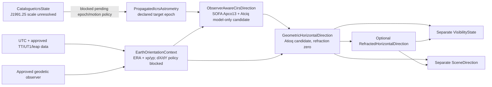

# Astronomy and Qibla specification

## Safety rule

This specification separates fixed conventions from unresolved domain choices. No implementation may fill a **MANUAL DOMAIN DECISION** with a convenient constant. Approved values must name authority, version/date, units, uncertainty or tolerance, and reviewer.

## Convention register

| Topic | Required policy | Class/status |
|---|---|---|
| Catalogue/version | Use the author-replacement files dated 2008-09-16 for CDS/VizieR I/311, *Hipparcos, the New Reduction*, as the sole Phase 1 source. Parse `hip2.dat` plus a required matching supplement for selected 3/7/9-parameter solutions. Raw and derived redistribution/deployment remain prohibited until clarified. | CONTRACT APPROVED FOR LOCAL NON-REDISTRIBUTING PHASE 1 / MILESTONE 2E PARSER; Milestone 2D authority resolution required before implementation |
| Catalogue identifier | Preserve numeric I/311 `HIP` as the only numerical-row key. The exact 19-ID list in the Milestone 2B audit is a technical review candidate, not approved historical membership. Cultural names and modern crosswalk claims live outside numerical rows. | CLARIFIED; row and cultural review required |
| Reference frame | Carry I/311's declared ICRS frame explicitly and verify the production mapping against source metadata and independent evidence. | SOURCE-DEFINED INPUT; production AST-003 decision unresolved |
| Catalogue reference epoch | Carry I/311's literal `Ep=1991.25` label separately from frame/equinox and observation time. ESA Gaia DR1 directly identifies I/311 and calls its parameter epoch `J1991.25`, so the representation is Julian. Neither record states the I/311 time scale; do not transfer the original catalogue's `J1991.25(TT)` or let an Astropy default decide it. Source-derived propagation remains unavailable pending exact authority or named astronomy-review approval. | Julian representation `SOURCE_SUPPORTED_FACT`; time scale `AUTHORITY_OR_EVIDENCE_MISSING` / `HUMAN_REVIEW_REQUIRED`; sensitivity `EXPERIMENT_REQUIRED` |
| Space motion | I/311 Appendix G Table G.3 defines source `pmRA` as `mu_alpha_star = (d alpha / dt) cos(delta)` in mas/yr. Normalize it as `properMotionRaCosDecMilliarcsecondsPerYear` and map directly to Astropy `pm_ra_cosdec` after unit conversion; do not apply a second cosine. CDS Catalogue Standard 2.0 defines `yr` as exactly 365.25 days. The proposed SOFA `iauPmsafe` adapter requires pole-guarded conversion to coordinate rate `dRA/dt`. Preserve parallax, `pmDE`, uncertainties, weights, solution family, and required supplemental acceleration/VIM evidence. Source epoch/derivative scale, parallax/distance, radial velocity, polar guard, warnings, range, and omission bounds remain open. | Component/rate unit `SOURCE_SUPPORTED_FACT`; propagation `AUTHORITY_OR_EVIDENCE_MISSING` / `HUMAN_REVIEW_REQUIRED` / `EXPERIMENT_REQUIRED` under AST-003 |
| Apparent-place effects | Milestone 2C.2 proposes a componentized SOFA `2023-10-11` CIO-family semantic route: preliminary source-to-declared-target-epoch propagation, `iauApco13`/`iauAtciq` observer-aware CIRS, an explicit Earth-orientation context, and `iauAtioq` geometric/optional refracted outputs. J2000.0 is the candidate target epoch required by the selected SOFA celestial interface; it is not a frame conversion. Candidate semantic inclusions are frame bias, IAU 2006 precession with IAU 2000A nutation, annual aberration, solar deflection, ERA-based Earth rotation, and diurnal aberration. Motion, parallax/RV, EOP/polar motion/celestial-pole offsets, refraction, implementation mapping, ranges, omission bounds, and tolerances retain their recorded blockers. | PROPOSED ROUTE/EFFECT MATRIX; HUMAN REVIEW AND EXPERIMENTS REQUIRED UNDER AST-003/004/006/007 |
| Time input | Parse ISO 8601 with explicit offset or an approved IANA zone, resolve to a UTC instant, and retain original zone for display/audit. | CLARIFIED |
| Earth time/orientation | UTC is the external timestamp; use approved UT1/TT/leap-second/IERS and polar-motion handling internally. Pin the EOP dataset/hash and extrapolation/approximation status. UTC≈UT1 is not silently assumed. | MANUAL DOMAIN DECISION AST-003 |
| Observer Earth model | Record geodetic datum/ellipsoid, geodetic coordinate order/sign, elevation datum, and whether elevation/horizon dip affect the selected model. | MANUAL DOMAIN DECISION AST-003/004/007 |
| Longitude | Degrees east are positive; west is negative. Latitude north is positive. | CLARIFIED |
| Sidereal time | Local apparent sidereal time candidate: `LAST = normalize24(GAST + longitudeEast/15)` hours. Exact GAST/mean-apparent policy follows AST-003. | CLARIFIED formula; policy manual |
| Hour angle | `H = normalizeSigned(LST - RA)` with west-positive hour angle. | CONFIRMED |
| Azimuth | Degrees/radians clockwise from geographic True North: north 0°, east 90°, south 180°, west 270°. | CONFIRMED |
| Three.js axes | `+Y` zenith/up, `-Z` north, `+X` east. | CONFIRMED |
| Refraction | Default candidate is deterministic geometric altitude with Astropy reference pressure 0; no refraction claim. | MANUAL DOMAIN DECISION AST-004 |
| Below horizon | Candidate normal mode hides and disables selection; an optional labelled teaching ghost may be allowed. | MANUAL DOMAIN DECISION AST-004 |
| Magnitude/visibility | Filter on the exact AST-001-approved photometric band/source column with explicit null/variability/threshold and teaching rules. Do not treat `Hp` and Johnson `V` as interchangeable or claim weather, extinction, or human visibility. | MANUAL DOMAIN DECISION AST-001/004 |
| Qibla model | Initial great-circle bearing on a sphere, clockwise from True North and normalized to `[0,360)`. | CONFIRMED/CLARIFIED |
| Kaaba coordinate | No coordinate is approved here; record authority, datum, order/sign, precision, version/date, uncertainty, and the convention-compatible Malaysian/domain validation method. | MANUAL DOMAIN DECISION AST-005 |
| Angular comparison | Use robust unit-vector separation; use wrapped circular difference for headings. | CLARIFIED |
| Numerical tolerances | Define an error budget and per-operation implementation, reference-disagreement, and learner-task tolerances, including near singularities. No fallback default. | MANUAL DOMAIN DECISION AST-006 |
| Independent implementation | The locked synthetic-only Astropy tool proves the environment, neutral-envelope, offline, and production-import boundaries. Milestone 2C.2 assigns explicit Astropy `SkyCoord`/space-motion and `CIRS`/`AltAz` transforms to the independent reference path only; direct PyERFA probes expose warnings and effect ablations. The production candidate is a separately implemented SOFA-based semantic route, and composed ERFA `atco13` is only a same-family consistency check. Official PyERFA stable documentation remains one patch behind the runtime. | Reference/production boundary proposed; PyERFA patch-doc acceptance, fixtures, comparisons, and reviewer approval unresolved |

## Canonical value objects

Every public value carries units and convention in its type or field name. Distinct
conceptual types prevent accidental double propagation or frame mixing:

- `UtcInstant` plus the original IANA zone/offset used for display;
- `ObserverLocation{geodeticLatitudeDeg, longitudeEastDeg, elevationM, datum,
  elevationDatum}`;
- `CatalogueIcrsState{raDeg,decDeg,sourceEpochLabel,epochRepresentation,
  epochScaleStatus,properMotionRaCosDec,...}`;
- `PropagatedIcrsAstrometry{raDeg,decDeg,targetEpochLabel,targetInstant,
  targetTimeScale,spaceMotionPolicy,warnings,...}`; the type records a successful
  declared target epoch/instant and does not itself promise J2000.0 or a frame
  transformation;
- `ObserverAwareCirsDirection{raDeg,decDeg,observationInstant,observerPolicy,
  celestialModel,...}`;
- `EarthOrientationContext{utc,tt,ut1,era,xp,yp,celestialPoleOffsetPolicy,
  eopVersion,eopHash,dataStatus,...}`;
- `GeometricHorizontalDirection{azimuthNorthEastDeg,geometricAltitudeDeg,
  enuDirection,observationInstant,observerPolicy,eopPolicy,singularityStatus,...}`;
- `RefractedHorizontalDirection{azimuthNorthEastDeg,refractedAltitudeDeg,
  sourceGeometricDirection,refractionPolicy,modelInputs,validityStatus,...}`;
- separate `VisibilityState` and `SceneDirection` records that retain their upstream
  state/policy identifiers;
- `EnuUnitVector{east,north,up}` and `BearingNorthEastDeg`.

Reject non-finite values and out-of-range latitude. AST-003/007 must choose exact
canonical representatives at longitude/angle wrap boundaries so serialization and
equality do not disagree.

Internal computation uses radians and double-precision JavaScript numbers. Serialization uses named degree fields; never serialize an unlabelled `[a,b]` coordinate pair.

The evidence classification and unresolved production decisions are audited in
`spikes/PHASE1_SCIENTIFIC_BEHAVIOUR_CONTRACT.md`. That Milestone 2C contract fixes no
new numerical value and remains open until AST-003/004/006/007 supply the approvals and
experiments identified there.

## Horizontal transformation

For observer latitude `phi`, declination `delta`, and west-positive hour angle `H`, a numerically clear east/north/up formulation is:

```text
east  = -cos(delta) sin(H)
north =  sin(delta) cos(phi) - cos(delta) cos(H) sin(phi)
up    =  sin(delta) sin(phi) + cos(delta) cos(H) cos(phi)

altitude = atan2(up, hypot(east, north))
azimuth  = normalize2pi(atan2(east, north))
```

This is equivalent to the report's spherical-trigonometry intent and directly matches the declared azimuth convention. At the zenith/nadir, azimuth is undefined; code must return a documented singular status and assessment must compare direction vectors rather than arbitrary azimuth.

## Three.js mapping

For radius `r`, geometric altitude `h`, and north-clockwise-east azimuth `A`:

```text
x =  r cos(h) sin(A)   // east
y =  r sin(h)          // up
z = -r cos(h) cos(A)   // north is -Z
```

The report's check `h=30°`, `A=45°`, `r=100` gives approximately `(61.24, 50.00, -61.24)` and is retained as an internal mapping fixture, not an independent astronomy oracle.

## Astrometric pipeline

Milestone 2C.2 proposes the following typed route for AST-003 review. It is a semantic
candidate aligned to the pinned SOFA issue, not approval of a production library or
implementation:



The production candidate uses SOFA `iauPmsafe` semantics for a preliminary
target-epoch propagation boundary. For the selected `iauAtciq`/`iauAtco13` candidate,
that target is J2000.0; this is an epoch input requirement, not an ICRS frame
transformation. Routine availability does not resolve the I/311 epoch or derivative
time scale, missing radial velocity, warnings, or acceptance tolerances, so no
source-derived `PropagatedIcrsAstrometry` is executable yet.

The `iauApco13`/`iauAtciq` convenience branch supplies the built-in model CIP/CIO from
IAU 2006 precession with IAU 2000A nutation and accepts `UT1-UTC` plus polar motion
`xp`,`yp`; it does not accept or apply observed celestial-pole offsets `dX`,`dY`.
Those observed corrections remain blocked and require a reviewed lower-level
`iauApco`-family or equivalent decomposed context if selected. Candidate `iauAtioq`
then owns the observed-place rotation and diurnal aberration; refraction coefficients
are explicitly zero for the geometric result, with an approved `iauRefco` policy
evaluated separately. AST-003 must approve the actual pure-TypeScript
algorithm/library and demonstrate that topocentric parallax and diurnal aberration are
each applied once. Astropy remains the independent reference path and is not the
production selection.

If required Earth-orientation data is missing or outside its valid range, the system must fail explicitly or enter a separately labelled, bounded approximation mode approved under AST-003. Runtime scenarios persist the EOP dataset/hash, extrapolation status, and approximation mode. Do not quietly change algorithms between browser, server, fixture generation, and evaluation.

Polaris/Al-Jady is an instructional cue near the north celestial pole; it is not identical to True North. The system must maintain distinct targets and knowledge components for locating the star and estimating the terrestrial direction.

KC-04 scores a terrestrial True-North bearing/direction defined by the approved task,
not the elevated line of sight to Polaris. KC-05 scores the approved Qibla bearing
relative to that True-North convention. EDU-002 and AST-007 must define how each task
captures these responses without allowing a visual cue or context-star selection rule to
make the answer trivial.

## Qibla bearing

For observer latitude/longitude `(phi, lambda)` and approved Kaaba `(phiK, lambdaK)`, all in radians with east-positive longitude, the initial spherical great-circle bearing is:

```text
deltaLambda = lambdaK - lambda
bearing = normalize2pi(
  atan2(
    sin(deltaLambda),
    cos(phi) * tan(phiK) - sin(phi) * cos(deltaLambda)
  )
)
```

Handle coincident/antipodal degeneracy explicitly. Qibla is compared to the learner's True-North-referenced direction using wrapped circular distance. An ellipsoidal calculation may be used for sensitivity/reference analysis, but changing runtime semantics requires a new proposed deviation.

## Angular comparison

For normalized 3D directions `u` and `v`:

```text
separation = atan2(length(cross(u,v)), dot(u,v))
```

Clamp or normalize only with documented floating-point guards. For two bearings, use:

```text
distance = abs(atan2(sin(a-b), cos(a-b)))
```

Correctness is `distance <= approvedTaskTolerance`; the exact tolerance and inclusive boundary are versioned with the scenario. Near-zenith direction tasks use vector separation, not azimuth difference.

## Validation specification

1. Pin the exact oracle program/commit, Astropy, ERFA, IERS source/file/hash and
   auto-download/extrapolation settings, catalogue snapshot/query, observer Earth model,
   refraction inputs, and all selected policies in a manifest.
2. A reviewer other than the runtime implementer approves the oracle protocol and a
   code-sharing audit. The generator must not import, call, or mechanically translate
   runtime TypeScript. Add policy-level differential cases so two implementations cannot
   agree merely because they share the same wrong convention.
3. Generate fixed expected equatorial/horizontal values independently. Preserve the
   permitted fixed outputs and provenance; the production runtime never calls the
   oracle.
4. Cross-check selected time/sidereal cases against a pinned, precisely identified USNO
   or other independent artifact and Qibla cases against the approved
   convention-compatible Malaysian/domain procedure. A contextual web page alone is
   not a numerical oracle.
5. Include meridian/east/west, angle wrap, UTC day boundary, leap-date and approved
   leap-second input behavior, equator, Malaysian latitudes, reference-only high
   latitude, horizon/below-horizon, zenith singularity, catalogue reference epoch,
   reference-only high-proper-motion data, and supported-range endpoints. These tests do
   not expand the learner UI beyond approved scenarios.
6. Produce an error-budget table per case/policy: catalogue position/space-motion
   uncertainty, omitted-effect bound, EOP/observer uncertainty, floating-point error,
   oracle disagreement, total scientific bound, and learner-task tolerance. Record both
   component and great-circle errors. Release requires every case within AST-006; no
   average may hide a failed fixture.
7. Separate implementation-numerics tolerances, scientific/reference tolerances, and
   learner-answer tolerances. Until AST-006 approves them, tests must fail as
   unconfigured rather than use a convenient constant.

Astropy documents refraction as unreliable near/below roughly 5° in common configurations, so any refracted near-horizon assessment needs an explicit exclusion or tolerance study. USNO's online material is a validation reference, not a runtime service dependency.
