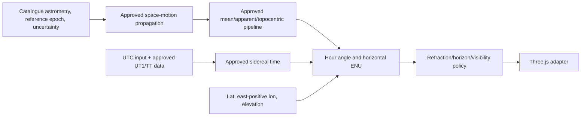

# Astronomy and Qibla specification

## Safety rule

This specification separates fixed conventions from unresolved domain choices. No implementation may fill a **MANUAL DOMAIN DECISION** with a convenient constant. Approved values must name authority, version/date, units, uncertainty or tolerance, and reviewer.

## Convention register

| Topic | Required policy | Class/status |
|---|---|---|
| Catalogue/version | A small reproducible subset from one approved astrometric catalogue. Hipparcos Main Catalogue, CDS/VizieR I/239, is a working candidate only. | MANUAL DOMAIN DECISION AST-001 |
| Catalogue identifier | Use the source's stable row identifier (HIP if I/239 is approved); cultural names are aliases, never coordinate keys. | CLARIFIED, conditional on AST-001 |
| Reference frame | Carry the catalogue frame explicitly. If I/239 is selected, verify and document ICRS semantics from the source metadata. | MANUAL DOMAIN DECISION AST-003 |
| Catalogue reference epoch | Carry the source's exact reference-epoch semantics separately from frame/equinox and observation time. For I/239, verify the source meaning of J1991.25 and any corresponding TT instant; do not collapse “Julian epoch” and “time scale” into one label. | MANUAL DOMAIN DECISION AST-001/003 |
| Space motion | For proper motion, parallax, radial velocity, and perspective acceleration, record an explicit implement-or-omit decision and quantified bound over the supported date range. Preserve component conventions and quality/uncertainty flags. If I/239 is selected, verify `mu_alpha*cos(delta)` and never apply cosine twice. | MANUAL DOMAIN DECISION AST-001/003 |
| Apparent-place effects | Name the treatment of annual/diurnal aberration, light deflection, precession/nutation, and topocentric parallax. Use one coherent mean/apparent pipeline and never mix catalogue-reference coordinates with incompatible sidereal-time semantics. | MANUAL DOMAIN DECISION AST-003 |
| Time input | Parse ISO 8601 with explicit offset or an approved IANA zone, resolve to a UTC instant, and retain original zone for display/audit. | CLARIFIED |
| Earth time/orientation | UTC is the external timestamp; use approved UT1/TT/leap-second/IERS and polar-motion handling internally. Pin the EOP dataset/hash and extrapolation/approximation status. UTC≈UT1 is not silently assumed. | MANUAL DOMAIN DECISION AST-003 |
| Observer Earth model | Record geodetic datum/ellipsoid, geodetic coordinate order/sign, elevation datum, and whether elevation/horizon dip affect the selected model. | MANUAL DOMAIN DECISION AST-003/004/007 |
| Longitude | Degrees east are positive; west is negative. Latitude north is positive. | CLARIFIED |
| Sidereal time | Local apparent sidereal time candidate: `LAST = normalize24(GAST + longitudeEast/15)` hours. Exact GAST/mean-apparent policy follows AST-003. | CLARIFIED formula; policy manual |
| Hour angle | `H = normalizeSigned(LST - RA)` with west-positive hour angle. | CONFIRMED |
| Azimuth | Degrees/radians clockwise from geographic True North: north 0°, east 90°, south 180°, west 270°. | CONFIRMED |
| Three.js axes | `+Y` zenith/up, `-Z` north, `+X` east. | CONFIRMED |
| Refraction | Default candidate is deterministic geometric altitude with Astropy reference pressure 0; no refraction claim. | MANUAL DOMAIN DECISION AST-004 |
| Below horizon | Candidate normal mode hides and disables selection; an optional labelled teaching ghost may be allowed. | MANUAL DOMAIN DECISION AST-004 |
| Magnitude/visibility | Filter on the exact AST-001-approved photometric band/source column with explicit null/variability/threshold and teaching rules. Do not treat `Hp` and Johnson `V` as interchangeable or claim weather, extinction, or human visibility. | MANUAL DOMAIN DECISION AST-001/004 |
| Qibla model | Initial great-circle bearing on a sphere, clockwise from True North and normalized to `[0,360)`. | CONFIRMED/CLARIFIED |
| Kaaba coordinate | No coordinate is approved here; record authority, datum, order/sign, precision, version/date, uncertainty, and the convention-compatible Malaysian/domain validation method. | MANUAL DOMAIN DECISION AST-005 |
| Angular comparison | Use robust unit-vector separation; use wrapped circular difference for headings. | CLARIFIED |
| Numerical tolerances | Define an error budget and per-operation implementation, reference-disagreement, and learner-task tolerances, including near singularities. No fallback default. | MANUAL DOMAIN DECISION AST-006 |
| Independent implementation | Fixed fixtures generated outside runtime using pinned Astropy plus USNO/domain cross-checks. | CONFIRMED/CLARIFIED |

## Canonical value objects

Every public value carries units and convention in its type or field name. Distinct
conceptual types prevent accidental double propagation or frame mixing:

- `UtcInstant` plus the original IANA zone/offset used for display;
- `ObserverLocation{geodeticLatitudeDeg, longitudeEastDeg, elevationM, datum,
  elevationDatum}`;
- `CatalogueAstrometry{raDeg,decDeg,frame,referenceEpoch,properMotion,...}`;
- `PropagatedIcrsCoordinate{raDeg,decDeg,observationInstant,spaceMotionPolicy}`;
- a named mean/apparent-of-date coordinate carrying its equinox/frame and algorithm;
- `HorizontalCoordinate{azimuthNorthEastDeg,geometricAltitudeDeg,observationInstant,
  eopVersion,refractionPolicy}`;
- `EnuUnitVector{east,north,up}` and `BearingNorthEastDeg`.

Reject non-finite values and out-of-range latitude. AST-003/007 must choose exact
canonical representatives at longitude/angle wrap boundaries so serialization and
equality do not disagree.

Internal computation uses radians and double-precision JavaScript numbers. Serialization uses named degree fields; never serialize an unlabelled `[a,b]` coordinate pair.

## Horizontal transformation

For observer latitude `phi`, declination `delta`, and west-positive hour angle `H`, a numerically clear east/north/up formulation is:

```text
east  = -cos(delta) sin(H)
north =  sin(delta) cos(phi) - cos(delta) cos(H) sin(phi)
up    =  sin(delta) sin(phi) + cos(delta) cos(H) cos(phi)

altitude = atan2(up, hypot(east, north))
azimuth  = normalize2pi(atan2(east, north))
```

This is equivalent to the report's spherical-trigonometry intent and directly matches the declared azimuth convention. At the zenith/nadir, azimuth is undefined; code must return a documented singular status and assessment must compare direction vectors rather than arbitrary azimuth.

## Three.js mapping

For radius `r`, geometric altitude `h`, and north-clockwise-east azimuth `A`:

```text
x =  r cos(h) sin(A)   // east
y =  r sin(h)          // up
z = -r cos(h) cos(A)   // north is -Z
```

The report's check `h=30°`, `A=45°`, `r=100` gives approximately `(61.24, 50.00, -61.24)` and is retained as an internal mapping fixture, not an independent astronomy oracle.

## Astrometric pipeline

The approved AST-003 decision must turn the following conceptual chain into one named algorithm and version:



If required Earth-orientation data is missing or outside its valid range, the system must fail explicitly or enter a separately labelled, bounded approximation mode approved under AST-003. Runtime scenarios persist the EOP dataset/hash, extrapolation status, and approximation mode. Do not quietly change algorithms between browser, server, fixture generation, and evaluation.

Polaris/Al-Jady is an instructional cue near the north celestial pole; it is not identical to True North. The system must maintain distinct targets and knowledge components for locating the star and estimating the terrestrial direction.

KC-04 scores a terrestrial True-North bearing/direction defined by the approved task,
not the elevated line of sight to Polaris. KC-05 scores the approved Qibla bearing
relative to that True-North convention. EDU-002 and AST-007 must define how each task
captures these responses without allowing a visual cue or context-star selection rule to
make the answer trivial.

## Qibla bearing

For observer latitude/longitude `(phi, lambda)` and approved Kaaba `(phiK, lambdaK)`, all in radians with east-positive longitude, the initial spherical great-circle bearing is:

```text
deltaLambda = lambdaK - lambda
bearing = normalize2pi(
  atan2(
    sin(deltaLambda),
    cos(phi) * tan(phiK) - sin(phi) * cos(deltaLambda)
  )
)
```

Handle coincident/antipodal degeneracy explicitly. Qibla is compared to the learner's True-North-referenced direction using wrapped circular distance. An ellipsoidal calculation may be used for sensitivity/reference analysis, but changing runtime semantics requires a new proposed deviation.

## Angular comparison

For normalized 3D directions `u` and `v`:

```text
separation = atan2(length(cross(u,v)), dot(u,v))
```

Clamp or normalize only with documented floating-point guards. For two bearings, use:

```text
distance = abs(atan2(sin(a-b), cos(a-b)))
```

Correctness is `distance <= approvedTaskTolerance`; the exact tolerance and inclusive boundary are versioned with the scenario. Near-zenith direction tasks use vector separation, not azimuth difference.

## Validation specification

1. Pin the exact oracle program/commit, Astropy, ERFA, IERS source/file/hash and
   auto-download/extrapolation settings, catalogue snapshot/query, observer Earth model,
   refraction inputs, and all selected policies in a manifest.
2. A reviewer other than the runtime implementer approves the oracle protocol and a
   code-sharing audit. The generator must not import, call, or mechanically translate
   runtime TypeScript. Add policy-level differential cases so two implementations cannot
   agree merely because they share the same wrong convention.
3. Generate fixed expected equatorial/horizontal values independently. Preserve the
   permitted fixed outputs and provenance; the production runtime never calls the
   oracle.
4. Cross-check selected time/sidereal cases against a pinned, precisely identified USNO
   or other independent artifact and Qibla cases against the approved
   convention-compatible Malaysian/domain procedure. A contextual web page alone is
   not a numerical oracle.
5. Include meridian/east/west, angle wrap, UTC day boundary, leap-date and approved
   leap-second input behavior, equator, Malaysian latitudes, reference-only high
   latitude, horizon/below-horizon, zenith singularity, catalogue reference epoch,
   reference-only high-proper-motion data, and supported-range endpoints. These tests do
   not expand the learner UI beyond approved scenarios.
6. Produce an error-budget table per case/policy: catalogue position/space-motion
   uncertainty, omitted-effect bound, EOP/observer uncertainty, floating-point error,
   oracle disagreement, total scientific bound, and learner-task tolerance. Record both
   component and great-circle errors. Release requires every case within AST-006; no
   average may hide a failed fixture.
7. Separate implementation-numerics tolerances, scientific/reference tolerances, and
   learner-answer tolerances. Until AST-006 approves them, tests must fail as
   unconfigured rather than use a convenient constant.

Astropy documents refraction as unreliable near/below roughly 5° in common configurations, so any refracted near-horizon assessment needs an explicit exclusion or tolerance study. USNO's online material is a validation reference, not a runtime service dependency.
