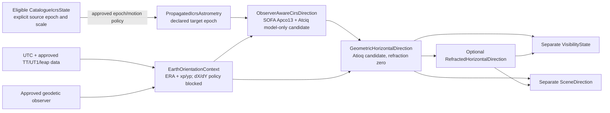

# Astronomy and Qibla specification

## Safety rule

This specification separates fixed conventions from unresolved domain choices. No implementation may fill a **MANUAL DOMAIN DECISION** with a convenient constant. Approved values must name authority, version/date, units, uncertainty or tolerance, and reviewer.

## Convention register

| Topic | Required policy | Class/status |
|---|---|---|
| Catalogue/version | The author-replacement files dated 2008-09-16 for CDS/VizieR I/311, *Hipparcos, the New Reduction*, are the sole source studied by the Phase 1 local spike. They are not selected as UFUQ's permanent catalogue by that fact. Milestone 2D must select the real source/release, rights, and minimal row set before 2E source-derived generation. Raw and derived I/311 redistribution/deployment remain prohibited until clarified. | LOCAL SPIKE CONTRACT ONLY; production/source authority belongs to Milestone 2D |
| Catalogue identifier | Numerical rows carry a stable internal `starId` plus versioned source-release identifiers in a crosswalk. An I/311 adapter preserves numeric `HIP`; a future reviewed Gaia release may coexist or replace astrometry without changing cultural records. The exact 19-HIP list is a technical review candidate, not approved source eligibility or historical membership. | SCIENTIFICPROFILEV1/2D CANDIDATE; crosswalk and rows require approval |
| Reference frame | Carry the selected source's declared ICRS frame explicitly and verify the production mapping against source metadata, code-independent reference evidence, and any applicable lineage-independent evidence. The I/311 spike declares ICRS but does not become the permanent source. | SOURCE-DEFINED INPUT; production AST-003/2D decision unresolved |
| Catalogue reference epoch | Carry I/311's literal `Ep=1991.25` label separately from frame/equinox and observation time. ESA Gaia DR1 directly identifies I/311 and calls its parameter epoch `J1991.25`, so the representation is Julian. Neither record states the I/311 time scale; do not transfer the original catalogue's `J1991.25(TT)` or let an Astropy default decide it. Source-derived propagation remains unavailable pending exact authority or named astronomy-review approval. | Julian representation `SOURCE_SUPPORTED_FACT`; time scale `AUTHORITY_OR_EVIDENCE_MISSING` / `HUMAN_REVIEW_REQUIRED`; sensitivity `EXPERIMENT_REQUIRED` |
| Space motion | I/311 Appendix G Table G.3 defines source `pmRA` as `mu_alpha_star = (d alpha / dt) cos(delta)` in mas/yr. Normalize it as `properMotionRaCosDecMilliarcsecondsPerYear` and map directly to Astropy `pm_ra_cosdec` after unit conversion; do not apply a second cosine. CDS Catalogue Standard 2.0 defines `yr` as exactly 365.25 days. The proposed SOFA `iauPmsafe` adapter requires pole-guarded conversion to coordinate rate `dRA/dt`. Preserve parallax, `pmDE`, uncertainties, weights, solution family, and required supplemental acceleration/VIM evidence. Source epoch/derivative scale, parallax/distance, radial velocity, polar guard, warnings, range, and omission bounds remain open. | Component/rate unit `SOURCE_SUPPORTED_FACT`; propagation `AUTHORITY_OR_EVIDENCE_MISSING` / `HUMAN_REVIEW_REQUIRED` / `EXPERIMENT_REQUIRED` under AST-003 |
| Apparent-place effects | Milestone 2C.2 proposes a componentized SOFA `2023-10-11` CIO-family semantic route: preliminary source-to-declared-target-epoch propagation, `iauApco13`/`iauAtciq` observer-aware CIRS, an explicit Earth-orientation context, and `iauAtioq` geometric/optional refracted outputs. J2000.0 is the candidate target epoch required by the selected SOFA celestial interface; it is not a frame conversion. Candidate semantic inclusions are frame bias, IAU 2006 precession with IAU 2000A nutation, annual aberration, solar deflection, ERA-based Earth rotation, and diurnal aberration. ScientificProfileV1 must still approve its route/mapping and motion, parallax/RV, EOP/polar-motion, and observed-CPO dispositions. Source-row eligibility belongs to 2D; geometric-only/no-refraction is already normative; broader effects are later; omission bounds and tolerances are postimplementation acceptance work. | PROPOSED ROUTE/EFFECT MATRIX REQUIRES AST-003 REVIEW; V1 GEOMETRIC EXCLUSION RESOLVED |
| Time input | ScientificProfileV1 normatively narrows RFC 3339 to whole-second `YYYY-MM-DDTHH:mm:ssZ`: fixed-width valid Gregorian fields, uppercase `T`/`Z`, no fraction, numeric offset, `-00:00`, wall time, Unix timestamp, bare JD, or implicit current time. Second `60` is structurally eligible only as `23:59:60Z` and becomes a validated UTC instant only when the approved leap artifact confirms that exact positive-leap date. Whole-second serialization is not scientific accuracy or permission to truncate. Local/IANA time and “now” resolve upstream into an immutable UTC `ScenarioSnapshot` with provenance. | RFC 3339/SOFA/IERS roles `SOURCE_SUPPORTED_FACT`; narrowed grammar/state boundary normative `PROJECT_DECISION`; concrete leap artifact remains 2D and leap/EOP policy remains AST-003/007 |
| Earth time/orientation | UTC is external; TAI/TT/UT1 remain typed internally. Milestone 2C.3 proposes request-time offline execution from immutable hash-addressed EOP/leap bundles, separate reviewed atomic updates, old-bundle replay, and explicit non-results. EOP source quality, artifact/field availability, and scientific approval are separate dimensions for each of `UT1-UTC`, `xp`, `yp`, and any selected `dX`, `dY`; no field promotes another. No production product/hash, stale rule, source-quality acceptance, date range, or degraded mode is approved. UTC≈UT1 and zero/nearest EOP are forbidden. | `PROJECT_DECISION` proposal; production selection `HUMAN_REVIEW_REQUIRED` / `AUTHORITY_OR_EVIDENCE_MISSING` under AST-003/006/007 |
| Observer Earth model | `ObserverPreset` requires a stable ID/site identity; finite north-positive geodetic latitude; east-positive longitude canonically in `[-180 deg,+180 deg)`; explicit datum/frame/realization, ellipsoid, typed height/reference surface, conditional coordinate epoch, accuracy state, provenance, data/artifact version, availability, validation, and approval. V1 selects only `umpsa-pekan-faculty-of-computing`, identifying Faculty of Computing, UMPSA Pekan Campus, Pahang, Malaysia. No browser geolocation, `(0,0)`, WGS 84, zero height, map pin, height conversion, or zero uncertainty is inferred. | Contract/site identity `PROJECT_DECISION` for 2C; exact values/source/accuracy/artifact `BLOCKS_2D_DATA_AUTHORITY`; polar/multiple/global domains remain later |
| Longitude | Degrees east are positive; west is negative. Latitude north is positive. | CLARIFIED |
| Sidereal time | Local apparent sidereal time candidate: `LAST = normalize24(GAST + longitudeEast/15)` hours. Exact GAST/mean-apparent policy follows AST-003. | CLARIFIED formula; policy manual |
| Hour angle | `H = normalizeSigned(LST - RA)` with west-positive hour angle. | CONFIRMED |
| Azimuth | Degrees/radians clockwise from geographic True North: north 0°, east 90°, south 180°, west 270°. | CONFIRMED |
| Three.js axes | `+Y` zenith/up, `-Z` north, `+X` east. | CONFIRMED |
| Refraction | ScientificProfileV1 normatively requests no refraction, accepts/creates no atmosphere input, inserts no pressure/temperature/humidity/wavelength/height-transfer/lapse default, and emits no refracted coordinate. `REFRACTION_NOT_REQUESTED` is distinct from later `REFRACTION_UNAVAILABLE`. Future refraction is a separate immutable stage requiring explicit provenance-bearing inputs and approved model/domain/warnings. Astropy defaults are reference-library behavior only. | V1 exclusion/no-default `PROJECT_DECISION` normative; later model/ranges/warnings `HUMAN_REVIEW_REQUIRED` / `AUTHORITY_OR_EVIDENCE_MISSING` under AST-004/006 |
| Below horizon | `BELOW_GEOMETRIC_HORIZON` is an attached classification, not a terminal failure or replacement for `GeometricHorizontalDirection`. It preserves signed altitude, azimuth when defined, exact singularity state, normalized ENU direction, provenance, warnings, statuses, and validation state. Geometric horizon means the astronomical local horizontal plane at geometric altitude zero before refraction; it is not visible/apparent horizon, sea/Earth-curvature or observer-height dip, terrain/buildings, clipping, or a learner cue. | V1 separation/result retention `PROJECT_DECISION` normative; numerical near-boundary/physical-dip/terrain/downstream policy remains later |
| Magnitude/visibility | ScientificProfileV1 emits no aggregate scientific `visible` boolean. Keep astronomical horizon; approved-band photometry/variability; Sun altitude/daylight/twilight; atmospheric extinction/transparency; cloud/weather; terrain/obstruction; light pollution; screen presentation; and learner eligibility as independent future components. No component promotes another. A geometric or rendered star is not thereby scientifically visible, and learner eligibility is not inferred. | V1 exclusion/separation `PROJECT_DECISION` normative; later component rules `AUTHORITY_OR_EVIDENCE_MISSING` / `HUMAN_REVIEW_REQUIRED` under AST-001/004/006/007 |
| Qibla model | Initial great-circle bearing on a sphere, clockwise from True North and normalized to `[0,360)`. | CONFIRMED/CLARIFIED |
| Kaaba coordinate | No coordinate is approved here; record authority, datum, order/sign, precision, version/date, uncertainty, and the convention-compatible Malaysian/domain validation method. | MANUAL DOMAIN DECISION AST-005 |
| Angular comparison | Use robust unit-vector separation; use wrapped circular difference for headings. | CLARIFIED |
| Numerical tolerances | Milestone 2C.5C defines separate source, model, Earth-orientation/time, observer, atmosphere, numerical-implementation, scene, and learner/assessment budget layers; a boundary-specific metric hierarchy; and candidate worst-case/covariance/RSS combination rules. RSS is prohibited without justified independence, an unbounded required term leaves the combined budget unbounded, and scene/learner tolerances cannot weaken astronomy accuracy. All six tolerance classes remain blocked with no numerical value. | `CANDIDATE_TOLERANCE_PROPOSAL` for method only; `FINAL_TOLERANCE_NOT_JUSTIFIED` / MANUAL DOMAIN DECISION AST-006 for every numerical threshold |
| Reference and independent validation | The locked synthetic-only Astropy tool proves the environment, neutral-envelope, offline, and production-import boundaries. Milestone 2C.2 assigns Astropy/PyERFA to a reference path that is code-independent of future TypeScript production, while recording its shared ERFA/SOFA lineage. Milestone 2C.3 requires future scientific fixtures to install exact EOP/leap artifacts, disable network/cache fallback, retain each field's source quality, availability, provenance, coverage, and scientific approval, plus observer/time provenance, warnings/outcomes, boundary cases, and deterministic hashes. Milestone 2C.5A freezes 24 experiment records, explicit execution/claim classes, shared-lineage disclosure, and separate fixture/result schemas. Milestone 2C.5B completes 9/9 bounded synthetic scopes: 24 exact checks pass, none fail, and six measurement-only checks cover 27 measurement records, all `MEASURED_NO_ACCEPTANCE`; same-family ERFA agreement is not independent validation. Milestone 2C.5C inventories every measurement and exact guard without promoting either. ProfileV1 acceptance needs multi-date, selected-source, one-preset-domain, EOP-boundary, and production/reference partitions; multiple observers gate only broader observer claims. The production candidate remains a separate SOFA-based semantic route; a genuinely independent oracle remains later work where required. | Reference/production boundary, experiment protocol, first synthetic guard batch, and error-budget method established; production data, PyERFA patch-doc acceptance, any required stronger-independent comparison, bounded terms, thresholds, and reviewer approval unresolved |

## ScientificProfileV1 lifecycle boundary

The candidate in `spikes/PHASE1_SCIENTIFIC_PROFILE_V1.md` narrows real V1 execution to
one selected preset identity instantiated by a 2D-approved observer artifact, one
bounded explicit-UTC domain carried by a versioned `SupportedTimeDomain`, one
2D-approved minimal star artifact, an explicit source-neutral astrometric input, an
approved route/effect disposition, immutable offline leap/EOP inputs, and geometric
horizontal output. Refraction and aggregate visibility are disabled. Internal types
remain multi-location and multi-source capable; no global operating domain is implied.

The generic `ObserverPreset` types, validators, no-default branches, and observer-
generic transformation interfaces may be implemented before 2D supplies the numerical
UMPSA artifact. Missing or unapproved observer data blocks real V1 evaluation, not that
contract implementation.

Authoritative semantics, approved profile decisions, frozen synthetic guards, and the
pinned reference environment are `PRE_IMPLEMENTATION` evidence. TypeScript/reference
residuals, supported-domain partitions, implementation error, and numerical tolerance
approval are `POST_IMPLEMENTATION` evidence. USNO NOVAS or another genuinely
independent positional-astronomy path is a later
`STRONGER_INDEPENDENT_VALIDATION` candidate; shared Astropy/PyERFA/ERFA/SOFA lineage
does not satisfy that stage.

An implementation may emit `GEOMETRIC_RESULT_PENDING_VALIDATION` after the remaining
profile and data gates open. It may not emit `APPROVED_GEOMETRIC_RESULT` until the exact
implementation/profile/data combination passes postimplementation production/reference
partitions, error-budget/tolerance review, and named scientific approval.

The V1 scientific outcome taxonomy distinguishes invalid supplied input, missing
required input, unavailable required artifacts, unsupported profile/domain, required
state/data without scientific approval, scientific execution failure, and a successful
pending-validation geometric result. Azimuth singularity and
`BELOW_GEOMETRIC_HORIZON` attach to a valid result; optional-stage-not-requested states
cannot erase it. These are semantic domain classes, not finalized JSON/HTTP codes.

At exact zenith or nadir the horizontal ENU projection is zero: altitude and normalized
ENU remain valid while azimuth is `UNDEFINED_SINGULAR`. A near-singular
`ILL_CONDITIONED` state requires a separately reviewed numerical/domain boundary; no
epsilon, display precision, or test tolerance is selected here.

Underlying scientific warnings and raw statuses are preserved with their producing
stage/routine/model and provenance. They are neither silently downgraded to success nor
automatically treated as scientific rejection; the approved route/data policy decides
their result disposition. Scientific status is separate from HTTP transport, logging,
and log severity.

## Canonical value objects

Every public value carries units and convention in its type or field name. Distinct
conceptual types prevent accidental double propagation or frame mixing:

- `SuppliedCanonicalUtcText{canonicalUtcText,parsedGregorianFields}` followed only
  after artifact-backed validation by
  `ValidatedUtcInstant{canonicalUtcText,leapArtifactIdentity,validationStatus}`;
- internal `UtcQuasiJulianDate`, `TaiTwoPartJulianDate`, `TtTwoPartJulianDate`, and
  `Ut1TwoPartJulianDate` values, each labelled by scale and the
  `MJD_ZERO_PLUS_OFFSET` split; UT1 additionally retains exact `UT1-UTC` field and EOP
  provenance;
- `TimeConversionEvidence{sourceState,destinationState,routineAndVersion,
  leapAndEopIdentities,warnings,statuses}`;
- `ObserverPreset{schemaVersion,presetId,siteIdentity,referencePointDescription,
  geodeticLatitude,geodeticLongitude,referenceSystem,referenceEllipsoidId,
  coordinateReferenceEpoch,height,heightConversion,coordinateAccuracy,provenance,
  dataVersionId,artifactIdentity,artifactAvailability,validationStatus,
  scientificApproval}`;
- `CatalogueIcrsState{raDeg,decDeg,sourceEpochLabel,epochRepresentation,
  epochScaleStatus,properMotionRaCosDec,...}`;
- `PropagatedIcrsAstrometry{raDeg,decDeg,targetEpochLabel,targetInstant,
  targetTimeScale,spaceMotionPolicy,warnings,...}`; the type records a successful
  declared target epoch/instant and does not itself promise J2000.0 or a frame
  transformation;
- `ObserverAwareCirsDirection{raDeg,decDeg,observationInstant,observerPolicy,
  celestialModel,...}`;
- `EopArtifactState{artifactId,version,hash,availability}` plus independent
  `EopFieldState{field,value,sourceQuality,fieldAvailability,sourceProvenance,
  coverage,scientificApproval}` records for `UT1-UTC`, `xp`, `yp`, and any selected
  `dX`, `dY`;
- `EarthOrientationContext{utc,tai,tt,ut1,era,eopArtifactState,eopFieldStates,
  celestialPoleOffsetPolicy,leapArtifactState,...}`;
- `GeometricHorizontalDirection{azimuthNorthEastDeg,geometricAltitudeDeg,
  enuDirection,observationInstant,observerPolicy,eopPolicy,singularityStatus,...}`;
- `RefractedHorizontalDirection{azimuthNorthEastDeg,refractedAltitudeDeg,
  sourceGeometricDirection,refractionPolicy,atmosphereObservation,modelInputs,
  validityStatus,warnings,...}`;
- `AtmosphereObservation{pressureHpa,groundTemperatureC,
  relativeHumidityFraction,observationWavelengthMicrometres,measurementInstant,
  measurementLocation,sourceProvenance,uncertainty,measuredOrDerivedStatus,
  derivationModelAndVersion,heightOrLapseAssumptions,validationStatus}`;
- separate `GeometricHorizonState`, `RefractedApparentHorizonState`,
  `PhysicalHorizonDipState`, `TerrainObstructionHorizonState`, `SceneClipState`, and
  `LearnerHorizonCueState` records;
- a componentized `VisibilityState` retaining independent astronomical-horizon,
  photometric/variability, Sun-altitude/daylight/twilight, atmospheric-extinction/
  transparency, cloud/weather, terrain/obstruction, light-pollution, screen, and
  learner-eligibility states and their policy/provenance/availability; and
- a separate `SceneDirection` that retains its upstream state/policy identifiers and
  applies no scientific correction;
- `EnuUnitVector{east,north,up}` and `BearingNorthEastDeg`.

`RefractedApparentHorizonState` means only comparison of an approved refracted
direction with apparent altitude zero under its named model/policy. Apparent altitude
zero is not geometric altitude zero, a visible skyline, terrain/building horizon,
physical horizon dip, or a SOFA/ERFA numerical guard. Each alternative requires its
own reviewed state and policy.

Reject non-finite values and out-of-range latitude. Observer longitude is east-positive
and canonically serialized in `[-180 deg,+180 deg)`, with `+180 deg` represented as
`-180 deg`; other angle-wrap decisions remain explicit so serialization and equality do
not disagree. The exact UMPSA reference point, numerical coordinates, Earth model,
height, accuracy and artifact provenance are 2D data and are not invented by this
specification.

The normative core outcome taxonomy separates invalid input, missing required input,
unavailable required artifacts, unsupported profile/domain, required state/data
without scientific approval, and scientific execution failure. Time refinements are
`TIMESTAMP_SYNTAX_INVALID`, `LEAP_SECOND_INSTANT_INVALID`,
`LEAP_VALIDATION_DATA_UNAVAILABLE`, `REQUIRED_TIME_SCALE_UNAVAILABLE`,
`EOP_FIELD_UNAVAILABLE`, `TIME_OUTSIDE_SUPPORTED_DOMAIN`,
`TIME_OR_EOP_STATE_NOT_APPROVED`, and `TIME_CONVERSION_WARNING`; the still-open EOP
policy controls the field/quality-specific dispositions, not this taxonomy.
Semantic evaluation proceeds through supplied-value validation, missing inputs,
artifact availability/integrity, domain, approval, scientific execution, result
creation, attached classifications, and excluded optional-stage states. Exact wire
codes remain under review. A valid geometric result carries an explicit pending-or-
approved validation state. The name
`APPROVED_GEOMETRIC_RESULT` is reserved until postimplementation production/reference,
error-budget/tolerance, and named-review gates pass. A
degraded result is reserved and unreachable until a named degraded mode, quantitative
bound, warning contract, and reviewer approval exist.

After a valid geometric direction exists, attach azimuth/singularity and geometric-
horizon classifications without erasing the result, then attach V1's
`REFRACTION_NOT_REQUESTED` and profile-excluded visibility-stage states. Core invalid,
missing, unavailable, unsupported, unapproved, or execution-failure outcomes always
precede these classifications. Later-profile semantic outcomes include
`APPROVED_REFRACTED_RESULT`, `REFRACTION_UNAVAILABLE`,
`REFRACTION_INPUT_INVALID`, `REFRACTION_OUTSIDE_VALID_DOMAIN`, and
`VISIBILITY_POLICY_UNAVAILABLE`; they are unreachable in V1 and their exact wire/HTTP
forms remain unapproved. `APPROVED_REFRACTED_RESULT` remains unreachable until its exact
model/version, complete meteorology/provenance, validity and combined supported
operating domains, warning policy, scientific tolerance, and named astronomy-review
approval exist. `BELOW_GEOMETRIC_HORIZON` attaches to and retains the valid geometric
result rather than replacing it.

The supported input domain is the intersection of the approved catalogue-propagation,
model/ephemeris, leap, per-field EOP, observer, and scenario domains. A later
validation/tolerance gate evaluates results over that domain; a nonexistent tolerance
domain must not prevent the input domain from being specified. No numerical date,
location, or height endpoints are approved by this specification.

The Milestone 2C.5C error-budget framework is recorded in
`spikes/PHASE1_SCIENTIFIC_ERROR_BUDGET.md` and its machine-checkable AST-006 ledger.
Layers A-F form the future astronomy scientific budget. Scene/render layer G and
downstream scenario/learner/assessment layer H remain separate. Scenario generation is
an independent downstream policy term in that layer, not learner uncertainty.
Catalogue/source, model, operational data,
observer, atmosphere, and production implementation terms are currently
`UNBOUNDED_UNRESOLVED`; exact Batch 01 guards have no numerical contribution.

Internal computation uses radians and double-precision JavaScript numbers. Serialization uses named degree fields; never serialize an unlabelled `[a,b]` coordinate pair.

The evidence classification and unresolved production decisions are audited in
`spikes/PHASE1_SCIENTIFIC_BEHAVIOUR_CONTRACT.md`. That Milestone 2C contract fixes no
new numerical value and remains open only until the profile-scoped AST-003/004/007
decisions and semantic outcome approval identified by the 2C.6 audit are recorded.
AST-006 numerical tolerances and production/reference experiments remain mandatory
postimplementation acceptance work rather than 2C entry conditions.

## Horizontal transformation

For observer latitude `phi`, declination `delta`, and west-positive hour angle `H`, a numerically clear east/north/up formulation is:

```text
east  = -cos(delta) sin(H)
north =  sin(delta) cos(phi) - cos(delta) cos(H) sin(phi)
up    =  sin(delta) sin(phi) + cos(delta) cos(H) cos(phi)

altitude = atan2(up, hypot(east, north))
azimuth  = normalize2pi(atan2(east, north))
```

This is equivalent to the report's spherical-trigonometry intent and directly matches the declared azimuth convention. At the zenith/nadir, azimuth is undefined; code must return a documented singular status and assessment must compare direction vectors rather than arbitrary azimuth.

## Three.js mapping

For radius `r`, geometric altitude `h`, and north-clockwise-east azimuth `A`:

```text
x =  r cos(h) sin(A)   // east
y =  r sin(h)          // up
z = -r cos(h) cos(A)   // north is -Z
```

The report's check `h=30°`, `A=45°`, `r=100` gives approximately `(61.24, 50.00, -61.24)` and is retained as an internal mapping fixture, not an independent astronomy oracle.

## Astrometric pipeline

Milestone 2C.2 proposes the following typed route for AST-003 review. It is a semantic
candidate aligned to the pinned SOFA issue, not approval of a production library or
implementation:



The production candidate uses SOFA `iauPmsafe` semantics for a preliminary
target-epoch propagation boundary. For the selected `iauAtciq`/`iauAtco13` candidate,
that target is J2000.0; this is an epoch input requirement, not an ICRS frame
transformation. Routine availability does not resolve the I/311 epoch or derivative
time scale, missing radial velocity, or warning policy, so no I/311-derived
`PropagatedIcrsAstrometry` is executable yet. A missing acceptance tolerance prevents
scientific acceptance, not source-neutral implementation or measurement-only
execution.

The `iauApco13`/`iauAtciq` convenience branch supplies the built-in model CIP/CIO from
IAU 2006 precession with IAU 2000A nutation and accepts `UT1-UTC` plus polar motion
`xp`,`yp`; it does not accept or apply observed celestial-pole offsets `dX`,`dY`.
Those observed corrections remain blocked and require a reviewed lower-level
`iauApco`-family or equivalent decomposed context if selected. Candidate `iauAtioq`
then owns the observed-place rotation and diurnal aberration; refraction coefficients
are explicitly zero for the geometric result, with an approved `iauRefco` policy
evaluated separately. AST-003 must approve the actual pure-TypeScript
algorithm/library and demonstrate that topocentric parallax and diurnal aberration are
each applied once. Astropy remains the code-independent reference path and is not the
production selection; its shared ERFA/SOFA lineage is not stronger independent
validation.

If required Earth-orientation data is missing or outside its valid range,
`ScientificProfileV1` fails explicitly. A later profile may expose a separately
labelled, bounded approximation only after AST-003/006 approval. Runtime scenarios
persist the EOP dataset/hash and status. Do not quietly change algorithms between
browser, server, fixture generation, and evaluation.

Polaris/Al-Jady is an instructional cue near the north celestial pole; it is not identical to True North. The system must maintain distinct targets and knowledge components for locating the star and estimating the terrestrial direction.

KC-04 scores a terrestrial True-North bearing/direction defined by the approved task,
not the elevated line of sight to Polaris. KC-05 scores the approved Qibla bearing
relative to that True-North convention. EDU-002 and AST-007 must define how each task
captures these responses without allowing a visual cue or context-star selection rule to
make the answer trivial.

## Qibla bearing

For observer latitude/longitude `(phi, lambda)` and approved Kaaba `(phiK, lambdaK)`, all in radians with east-positive longitude, the initial spherical great-circle bearing is:

```text
deltaLambda = lambdaK - lambda
bearing = normalize2pi(
  atan2(
    sin(deltaLambda),
    cos(phi) * tan(phiK) - sin(phi) * cos(deltaLambda)
  )
)
```

Handle coincident/antipodal degeneracy explicitly. Qibla is compared to the learner's True-North-referenced direction using wrapped circular distance. An ellipsoidal calculation may be used for sensitivity/reference analysis, but changing runtime semantics requires a new proposed deviation.

## Angular comparison

For normalized 3D directions `u` and `v`:

```text
separation = atan2(length(cross(u,v)), dot(u,v))
```

Clamp or normalize only with documented floating-point guards. For two bearings, use:

```text
distance = abs(atan2(sin(a-b), cos(a-b)))
```

Correctness is `distance <= approvedTaskTolerance`; the exact tolerance and inclusive boundary are versioned with the scenario. Near-zenith direction tasks use vector separation, not azimuth difference.

## Validation specification

1. Pin the exact oracle program/commit, Astropy, ERFA, IERS source/file/hash and
   auto-download/extrapolation settings, catalogue snapshot/query, observer Earth model,
   refraction inputs, and all selected policies in a manifest.
2. A reviewer other than the runtime implementer approves the oracle protocol and a
   code-sharing audit. The generator must not import, call, or mechanically translate
   runtime TypeScript. Add policy-level differential cases so two implementations
   cannot agree merely because they share the same wrong convention. Astropy
   high-level transforms and direct PyERFA calls disclose their shared ERFA/SOFA
   lineage and are not independent algorithms for same-family agreement.
3. Before execution, register the experiment's stable ID, scientific question,
   permitted/prohibited claims, input class, exact dependencies and conventions,
   artifacts, partitions, comparison lineage, metrics, repetition/hashes, result
   schema, acceptance mode, reviewer gate, and follow-up decision under the 2C.5A
   protocol. Source-derived and production-generated inputs remain unavailable unless
   their separate gates are open.
4. Generate fixed expected equatorial/horizontal values through the pinned
   code-independent reference process. Preserve the permitted fixed outputs,
   provenance, and shared-lineage disclosure; the production runtime never calls the
   reference tool. This step is not by itself stronger algorithmic independence.
5. Where the claimed release boundary requires stronger independent validation,
   cross-check selected time/sidereal cases against a pinned, precisely identified
   USNO or other lineage-independent artifact. Separately, cross-check Qibla cases
   against the approved convention-compatible Malaysian/domain procedure when Qibla is
   in scope. A contextual web page alone is not a numerical oracle.
6. For V1, include meridian/east/west, angle wrap, UTC day boundary, leap-date and
   approved leap-second input behavior, the approved preset and its uncertainty/domain
   boundaries, horizon/below-horizon, zenith singularity, catalogue reference epoch,
   reference-only high-proper-motion data, and supported-range endpoints. Additional
   Malaysian, equatorial, high-latitude, height, and arbitrary-location partitions gate
   only profiles that claim those domains. These tests do not expand the learner UI
   beyond approved scenarios. Later refraction cases additionally
   retain explicit atmosphere inputs/provenance, geometric and refracted states or
   non-results, model/domain/warnings, geometric versus apparent horizon,
   below-horizon partitions, and independent visibility components; no fixture may
   rely on an unrecorded library default.
7. Produce an error-budget table per case/policy using the 2C.5C ledger terms:
   catalogue position/space-motion uncertainty and covariance, model/omitted-effect
   bounds, per-field EOP/time and observer uncertainty, atmosphere when requested,
   floating-point/production error, and independent-oracle disagreement. Record both
   component and boundary-appropriate vector errors. Use RSS only for justified
   independent random terms; keep systematic/correlated/asymmetric terms explicit.
   Scene and learner quantities remain separate. Release requires every case within
   AST-006; an unresolved required term leaves the case unbounded and no average may
   hide a failed fixture.
8. Separate implementation-numerics tolerances, scientific/reference tolerances, and
   learner-answer tolerances. Until AST-006 approves them, numerical acceptance
   assertions remain inactive/fail closed as unconfigured rather than use a convenient
   constant. Postimplementation comparison must still run and emit
   `MEASURED_NO_ACCEPTANCE` so the evidence needed to propose a threshold can exist;
   only exact supported invariants can pass or fail before then.

Milestone 2C.5B Batch 01 satisfies only the registration/execution-shape prerequisite
in item 3 and the exact/measurement separation in item 8. It supplies code-separation
and shared-lineage evidence toward item 2, but the required independent reviewer
approval and policy-level differential cases remain open. It imports no production
astronomy, uses no source-derived values, and therefore cannot satisfy items 4-7 as a
production/reference correctness claim or activate `test:reference`.

Milestone 2C.5C interprets those committed results without regenerating canonical
evidence or changing a hashed Batch input: all 27 records remain measured values
without acceptance, and the 24 exact passes retire only
bounded synthetic mutation/state-contract classes. No serialized zero, same-family
agreement, hash identity, or deterministic replay supplies an implementation or
scientific tolerance.

Astropy documents its ERFA-based refraction as inaccurate below about 5 degrees and
warns of meaningless or highly discrepant behavior near/below zero altitude in
affected cases. These are source-supported reference-library limitations and
experiment partitions, not UFUQ validity thresholds or tolerances. USNO's online
material is a validation reference, not a runtime service dependency.
