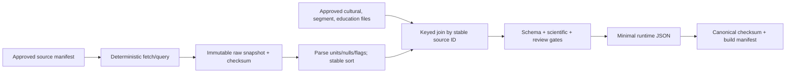

# Data strategy

## Principle

Scientific measurements, cultural interpretation, visual relationships, pedagogy, and deployable artifacts are different data classes. They have different authorities and review gates and must not be merged into an untraceable hand-edited JSON file.

## Data classes

| Class | Contents | Authority | Repository policy |
|---|---|---|---|
| 1. Numerical astronomical catalogue | Stable source ID; catalogue astrometry and reference epoch; the approved space-motion, photometric, uncertainty/covariance and quality fields or a reviewed omission rationale | Approved catalogue/table/version AST-001 | Acquisition output is immutable; commit only if licence permits |
| 2. Culturally curated Arabic mappings | Arabic Unicode form, transliteration(s), description, approved HIP/source members, pointer relationships, citations, reviewer/status | Ilm al-Falak/cultural expert AST-002 | Human-reviewed YAML/JSON; no coordinate duplication |
| 3. Asterism line segments | Ordered edge pairs using stable catalogue IDs, style/semantic role, mapping version | AST-002 approved relationship source | Human-reviewed; referential-integrity checked |
| 4. Educational metadata | KC, lesson/task templates, permitted cues, misconception/feedback codes, assistance class | Supervisor/learning expert BKT-004 | Versioned reviewed content, separate from scientific rows |
| 5. Generated runtime JSON | Minimal joined projection needed by browser: normalized numeric fields, approved labels/edges/metadata, schema and versions | Deterministic build from 1–4 | Never hand-edit; generated header/manifest/checksum required |

Operational learner data is governed by `SECURITY_AND_PRIVACY.md` and is not part of the catalogue pipeline.

## Source and provenance manifest

Before retrieval, create a machine-readable source manifest containing:

- catalogue name, publisher/archive, catalogue/table ID and release/version;
- canonical metadata/download/query URL, exact selected columns, deterministic culturally-required/context-star subset rules, exclusions, duplicate/component resolution, filters, row-order rule, and units;
- coordinate frame, reference-epoch semantics, proper-motion/parallax/radial-velocity conventions as selected, magnitude band/variability meaning, uncertainties/covariance or exclusion rationale, null and quality-flag interpretation;
- retrieval timestamp in UTC, retrieval tool/version, source citation, licence URL/text identifier, and redistribution determination;
- raw byte SHA-256, normalized table SHA-256, expected row count, and approved reviewer/date.

AST-001 is unresolved. Hipparcos Main Catalogue via ESA and CDS/VizieR I/239 is a candidate, not a selected fact. Do not add catalogue rows until the catalogue metadata and redistribution terms are manually approved.

## Acquisition and transformation

The future `tools/catalogue` command, introduced only by an ExecPlan, must implement:

The command verifies transport/result bytes before transformation, fails on source drift unless an explicit update workflow is in progress, and emits a deterministic result for the same inputs/tool version. Coordinates come only from the numerical source—not websites, label files, screenshots, or report diagrams.

Phase 1 uses a minimal production-shaped instance of this same path: approved manifest,
permitted immutable input, normalization, required curation join, schema validation,
canonical serialization, and hash. Phase 2 expands rows and policies; it does not replace
a hand-made Phase 1 fixture with a different provenance mechanism.

## Raw snapshot policy

- Prefer retaining the exact permitted raw source or query result in an access-controlled reproducibility store with immutable checksum.
- Commit it only when the source licence explicitly permits repository redistribution and the repository audience is compatible.
- If redistribution is unclear or prohibited, commit only manifest, query/acquisition script, expected metadata/checksum where allowed, and citation; an authorized reproducibility store retains the immutable bytes when policy permits. A public fresh checkout can then verify manifests/scripts but cannot honestly claim byte-for-byte regeneration without authorized access.
- Never substitute an undocumented later response under the same version.
- A source update creates a new catalogue version and comparison report; it does not overwrite the old manifest used by historical scenarios.

## Schemas and validation

Schemas reject unknown required semantics and at least verify:

- unique, non-empty stable source IDs;
- finite required astrometric/photometric/uncertainty values and their documented ranges/units; every omitted uncertainty/covariance or space-motion field has an approved error-bound rationale;
- explicit frame/epoch/catalogue version; no mixed frames or epochs in one unlabelled artifact;
- approved handling of missing/flagged astrometry;
- Unicode NFC for Arabic and transliteration text;
- cultural records with citations, reviewer, review date, and `approved` status;
- segment endpoints that resolve to selected catalogue IDs, no self/duplicate edges unless explicitly justified;
- every task/KC/cue reference resolves and every runtime-required object is present;
- stable canonical ordering, schema version, generator version, input hashes, and output SHA-256;
- one specified canonical byte representation covering numeric formatting, object-key/row ordering, UTF-8/NFC, newline policy, and excluded volatile metadata.

The build fails if a cultural relationship is unapproved, a scientific row was edited after acquisition, a checksum differs, or a coordinate appears only in curation.

## Generated-file policy

Generated JSON is a build artifact with a header or companion manifest containing input versions/hashes, schema version, generator version, deterministic build-time policy, and licence/citation notices. Volatile retrieval/audit timestamps live outside the canonical payload; two builds from identical approved inputs and tool versions must produce identical bytes. It is committed only after AST-001 licensing approval; otherwise it is generated in authorized build/deployment storage. Code review changes source/curation inputs or transformer logic, never generated rows alone.

AST-003 decides whether runtime rows carry catalogue-reference astrometry for runtime
propagation, precomputed scenario-time directions, or both. The browser and API consume
the same generated bytes/hash, validate schema/version/checksum before use, and refuse
scenario issuance/loading on mismatch. Scenario and attempt records store that hash and
the astronomy/EOP/build links needed for the qualified replay claim.

## Licensing and citation

Maintain a licence record per input and per distributed output: rights holder, licence identifier/link, required attribution, transformation/redistribution conditions, non-commercial constraints, approval, and display/report citation text. ESA's Hipparcos catalogue page indicates an ESA licence/credit requirement, while archive metadata may not by itself resolve downstream redistribution; institutional review remains AST-001. A public URL is not permission to copy.

## Manual review gates

1. **Scientific gate:** catalogue fields, flags, frame, epoch, proper motion, and sample rows reviewed against source metadata.
2. **Cultural gate:** Arabic form, transliteration, membership, pointer relations, and segments approved under AST-002.
3. **Educational gate:** KC/task/cue semantics approved under BKT-004.
4. **Licence gate:** raw and generated redistribution approved under AST-001.
5. **Release gate:** deterministic rebuild, schemas, hashes, referential integrity, and visual spot-check pass.

The same reviewer should not silently approve every domain. Review records are versioned inputs, not comments lost in chat.

## Update and reproducibility procedure

1. Open a data-update ExecPlan and new immutable version; record purpose and old hashes.
2. Approve source/licence changes before retrieval.
3. Fetch with the pinned tool/query; retain bytes and hashes according to licence.
4. Produce a machine-readable diff: rows added/removed, changed fields, flags, cultural mappings, segments, and downstream fixtures.
5. Re-run all schemas, astronomy reference tests, scene/raycast tests, screenshots, and performance benchmark.
6. Obtain scientific/cultural/educational reapproval for affected records.
7. Publish a new generated hash and scenario policy version. Retain old artifacts needed for audit subject to licence/retention rules.
8. Update research notes, ADR if semantics changed, traceability, risk/status, and final-report evidence index.
